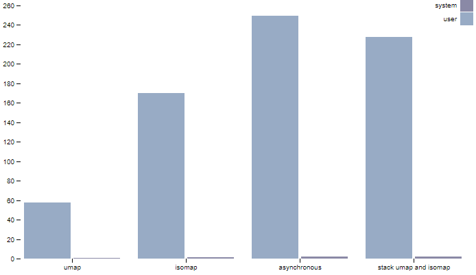

# CS5352-P1-submission-Ngan-Vuong-Thuy-Nguyen
 CS5352 Project 1

In this project, we want to compare the profiling data of UMAP and ISOMAP algorithms

## Overview about UMAP and ISOMAP

UMP and ISOMAP are reduce dimension technique for estimating the intrinsic geometry of a data manifold.

## Set up

To run the python code, it is require to install
- python v3 or anacoda program
- Umap: pip install umap-learn
- Isomap: pip install -U scikit-learn
- psutil: pip install psutil

## Source code

I use jupiternote for write python code. These files can be found in this directory: 
- project1_umap.ipynb : running UMAP
- project1_isomap.ipynb : running ISOMAP
- project1_bothAlgorithm.ipynb : running UMAP and ISOMAP in different thread

## Results

For eliminate the time for import data and library, I record the profiling data twice (before and after running algorithms). Lateron, I subtract the data (not the peak data) to get the actual value during running code.
The profiling datas have been save as csv:
- Umap: umap_measure.csv
- Isomap: isomap_measure.csv
- Umap & Isomap: umap_isomap_measure.csv

Then I use js and d3js libary to plot the result [index.html](index.html)
In my visualization. The "asynchronous" mean running UMAP and ISOMAP in different thread and "stack umap and isomap" is the sum up of the umap and isomap results.

CPU usage in percentage:

Memory usage RSS and VMS:

Number of page faults:

Hard drive usage in term of write and read bytes:

In overrall, UMAP has produce more efficently than ISOMAP interm of memory and running time. When running both umap and isomap in different thread, it is still less costly than running both algorithm sequently. For some reasons, the running time of "asynchronous" longer than synchronous.

